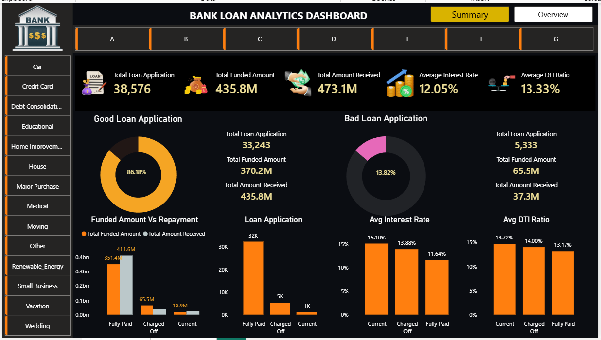
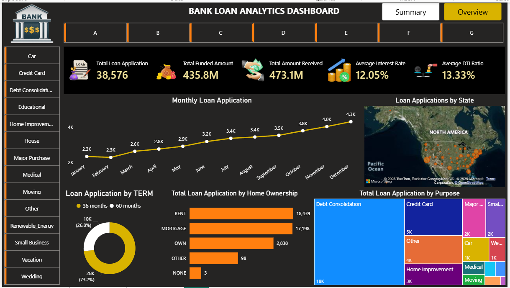

# Bank-Loan-Analytics-Dashboard-Power Bi
## Project Overview

This project analyzes bank loan data using Power BI to provide insights into loan applications, funded amounts, repayments, interest rates, and borrower profiles.

The dashboard helps stakeholders monitor loan performance, identify trends, and evaluate loan risk.

---
## Tools Used
- Power BI
- Power Query
- DAX
- Microsoft Excel
- SQL
---
## Key KPIs
- Total Loan Applications
- Total Funded Amount
- Total Amount Received
- Average Interest Rate
- Average DTI Ratio
---
## Dashboard Pages
### 1. Summary Dashboard

Provides detailed loan performance insights:

- Good Loan vs Bad Loan Analysis
- Funded Amount vs Repayment
- Loan Status Analysis
- Interest Rate Analysis
- DTI Ratio Analysis
 
### 2. Overview Dashboard

Provides a high-level view of:

- Monthly Loan Application Trend
- Loan Applications by State
- Loan Applications by Term
- Home Ownership Analysis
- Loan Purpose Analysis

---
## Business Insights

- Most applications are categorized as Good Loans.
- Debt Consolidation is the most common loan purpose.
- Mortgage and Rent account for the majority of borrowers.
- Loan applications show steady growth throughout the year.
- Fully Paid loans contribute the highest repayment amount.
---
## Skills Demonstrated

- Data Cleaning
- Data Transformation
- Data Modeling
- DAX Calculations
- Data Visualization
- Dashboard Design
- Business Intelligence
- Analytical Thinking
---
## Project Files

- Power BI Dashboard (.pbix)
- Dataset (.xlsx)
- Dashboard Screenshots

  ---
## Author

Madhuri Shivsharan

Aspiring Data Analyst

